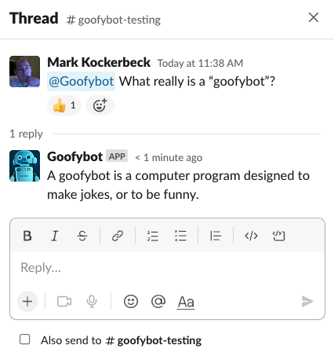

# goofybot
a Slackbot integration with GPT-3 from OpenAI just for fun

# Installation & Usage
Get the dependencies
```
pip install -r requirements.txt
```

Setup your credentials as environment variables
```
export SLACK_BOT_TOKEN="xoxb-xxxxx"
export SLACK_APP_TOKEN="xapp-1-xxxx"
export OPENAI_APP_TOKEN="sk-xxxxxx"
```

Be sure to enable Socket Mode, Events, add the right scopes, and subscribe to the right Events in [Slack API control](https://api.slack.com/apps/)

Run the `slackbot.py` script
```
python slackbot.py
```

Then just mention your bot & ask questions!

